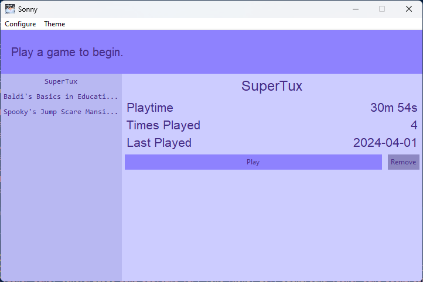

# Sonny
Sonny counts playtime, times played, and last played (While the app remains open) on any game you input into the app. To begin, you first need to input a game.

## Inputting a Game
1. In the top-left corner you'll find "Configure", once clicked, find and click on "Add Game".
2. A open dialog will open, you will then need to find the game exe file and click on it.
3. After that, a new box will open and you will pick a name for it and click "Submit".

That will be it! You can finally open the game and the application will count playtime.

## Layout of the App
The top will show the last game played and how long you played for as well as the current time played for that game. The left panel is all the games input into the app and any you click on will bring you to a page with your play information on it. The right panel is the play information, this will show you Playtime, Times Played, and Last Played. Depending on the game, this information will never get updated. On this page you will find two buttons, the first button is to launch the game; as long as the game path is correct, launching a game will work. The second button is to remove the game from the listing, this will not delete any data about the game, it will only stop giving and getting your play information.

